# ✨ Graphic Design Process Documentation

## 3/31

For 3/31, I sketched the basic shape of the entire admin panel, including the following detailed parts as listed follow,

- Navbar
- Signin, Signup page
- Profile page
- Preference page
- Chat page
- Event, calendar page
  - Year
  - Week
  - Days
- Invoice page
- Analytics page
- Main dashboard page

These above are the main features should be noted in an admin panel for better user experiences yet a complex and featured panel for more usages. An admin panel should have two color schemes, dark and light as according to design principle by MDUI (Google material design principle), also a dark-light system fits the SEO standards for web search & responsive designs. I mainly created the light version of the admin panel, including the navigation bar and it's affiliated dropdown menu. Besides this, a good font should also be presented on the panel, the font family I chose was *jet Brains Mono* & *Open Sans*, these two fonts are all available on Google Fonts, note that the former fonts was released under MIT license, and the latter was released under OTF license, so it is fully available and free for non-commercial uses.

## 4/11

For 4/11, I have achieved my general purposes and required basis of my design, I started digging into the detailed part of the navigation bar, I made my navigation bar into divided follow as shown in the image below.

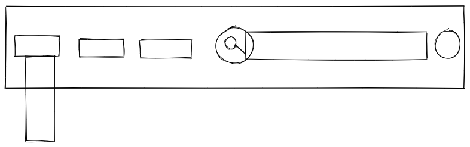

The image include a basic structure of a navigation bar in general, starting from left to right, the rectangle indicates some text and, the vertical rectangle below indicates a dropdown menu with some text inside with some text,
navigate to the right, a easy search bar present as follow, when the user click on to the search bar, it presents the follow interaction as indicated in the image.

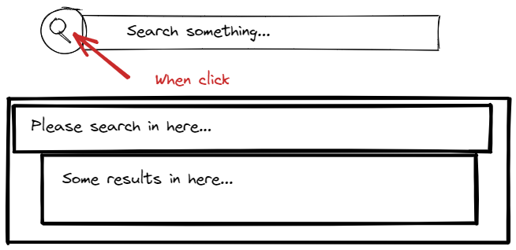

<small>Besides this hand-drawn styled images are created on Excalidraw</small>

The image here indicates when a user click on the search bar, the search bar will pop into an isolated `pjax` powered bigger search tab in the window, when user search the word inside, related result will be shown in the following box, the matching keywords will be marked/highlighted for easier recognition. The placeholder text font there is JetBrains mono font. The circle button on the very right is the dark-light switching button, the interaction is achieved as in follow gif.


The dark mode and light mode style design was took from my own blog page, it was originally created in figma, and rewrote into a functional dark-light system via `CSS` & `JS`!

Besides the search bar, the sign up page is also mostly done, the rough sketch is shown in the following image,

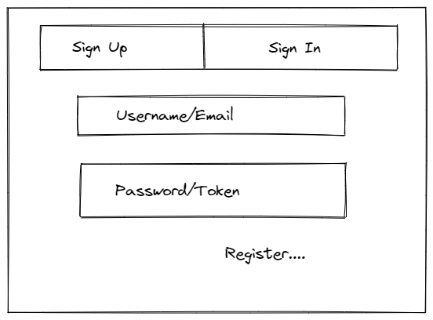

The signup page is just simply achieved via two seperate tab, the sketch there shows a rectangular shape, but in my design, all parts has a rounded corner.

## 4/13

For 4/13, I fixed some lining issue and padding issue with signup page to make it more responsive, and I added a small dark-light button to the bottom of the sign in page. Besides this I also started creating the profile page, this relatively took longer then I expected, the profile page is still in progress with avatar portion, bio, and other additional information, besides this I also finalized login/signup page design as shown follow,

| Login | Signin |
| ----- | ------ |
| 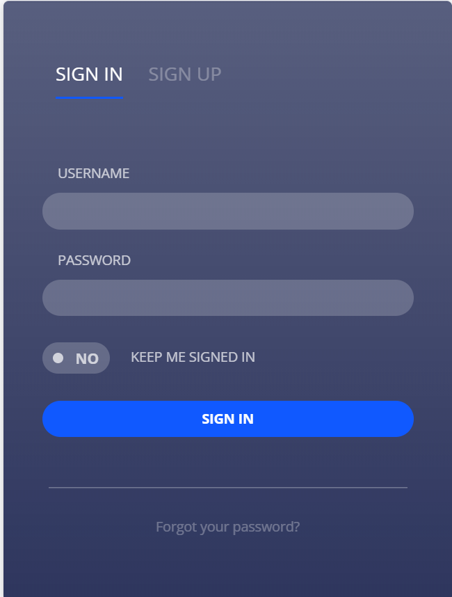     |  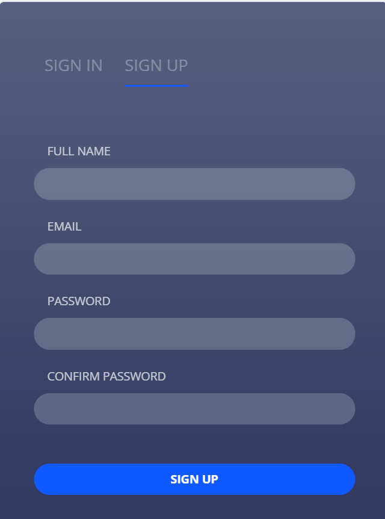      |

This page is in dark mode, but I didn't decide to work on light mode right away because it might break the entire color scheme of the panel, so after I finish dark mode, I'll change and adjust the color scheme to light mode universally. (Don't ask me why I did nav bar with light mode first, I thought it was easier, but no it was not).

## 4/15

For 4/15, I continued working on my profile page, but I met a lot of padding issues, and the worst thing happened, my figma crashed, since figma is a web app, it took at least half an hour for me to actually close the web page from my browser, so I decided to move on to the next part, the preference page and go back to the profile page, the preference page seemed not be a page, but more of like a multifunctional side bar with options listed inside, the design is shown follow. After I finished the sidebar, I worked on the profile page based on the inspiration of monsnary layout.

| sketch                             | Finalized               |
| ---------------------------------- | ----------------------- |
| 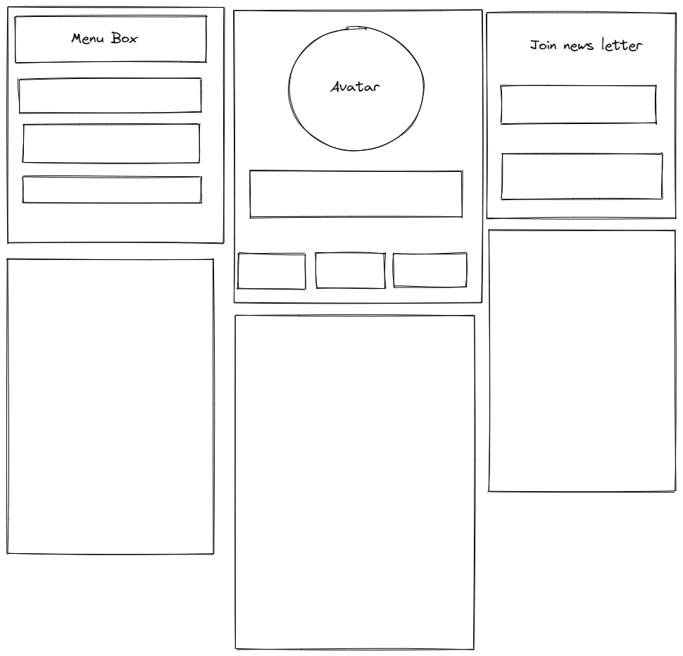 | 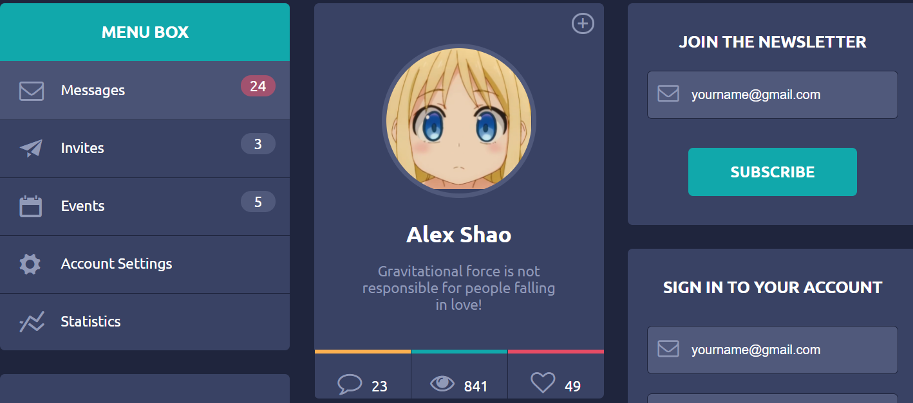 |


The inspiration was came from http://graphicburger.com/flat-design-ui-components/. The link attached above.

## 4/19

For 4/19, I continued working with the profile page with some personal stats and graphs, the idea was inspired by Apache ECharts, it's an open source project written in Typescript that serves beautiful web charts for direct localization, it is shown follow, besides this I didn't work on other things due to PCR testing.

| Stats Graph        | Basic Graph           |
| ------------------ | --------------------- |
| 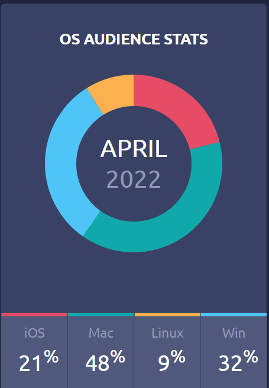 | 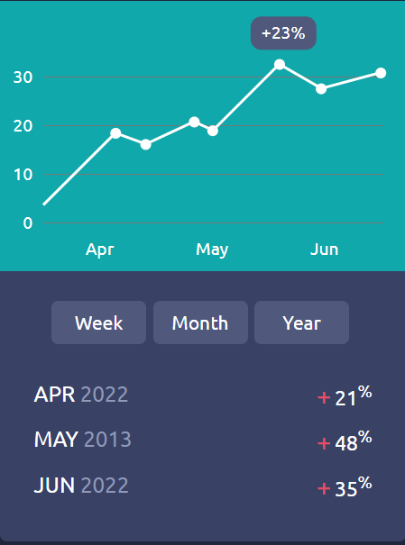 |

This two tiles is located under profile.

## 4/21

Today I gradually finished my profile page, but the worst thing happened, my app crashed, entirely, my figma account was suspiciously marked as "flagged" out of no reason, I contacted the figma community, they said I have to wait for 1-3 days in order for a full response, so I was not able to get into figma for further designs but I migrated my work into AI.

I ultimately digged into my dashboard page, I started working on the dashboard with a further sketch that divide the parts into the following, a good dashboard should follow the principle as described in MDUI elements,

- Consider your audience.
- Determine your goals.
- Choose relevant KPIs.
- Tell a story with your data.
- Provide context.
- Don't try to place all the information on the same page.
- Select the right type of dashboard.
- Use the right type of chart.

| Sketch                          | Dashboard V1         |
| ------------------------------- | -------------------- |
| 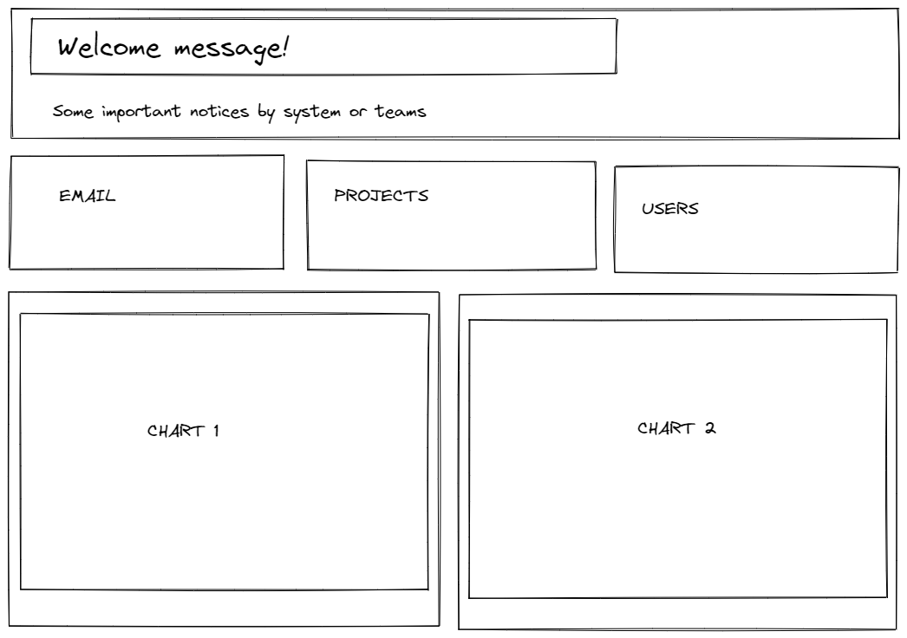 | 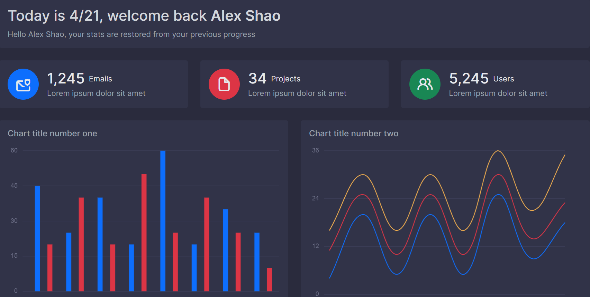 |

A dashboard should clearly tell the user what is going on, what is going next, and set the important details alarmed to get attention from the user, so this is what I tried to do. The top part is the welcome message, which will be likely user-friendly and it also forms as a feature of placeholder to make the page not so empty, and the following is the main three important part to let my user get attention: email, projects, and user. Users can easily find out what is happening with them and what they have to do. The next following are two graph, bar charts and line graph, these two graph could be used in any scenario to describe statistics happening at presents, and the inspiration of the charts still comes from Apache ECharts.

## 4/25

**Happy 17th birthday to me!!! :)**, for todays work, I mainly focused on fixing small details and padding issues with the dash board itself and make it responsive on mobile look, as follow,

| Static View            | Dynamic View         |
| ---------------------- | -------------------- |
| 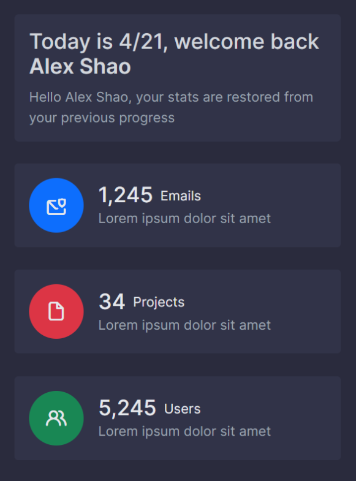 |  |

And thanks to Google Chrome's built in mobile view and desktop view switching feature for me to achieve this goal, and the mobile model used is IPhone X, the standard mobile view model.

## 4/27

For 4/27, I mainly focused on the dashboard's second part, the version 1 of the sidebar, the sidebar contains the following, a search bar, and quick navigation buttons, also dropdown menu for wider usages,

| Sketch                 | Sidebar V1                  |
| ---------------------- | --------------------------- |
| 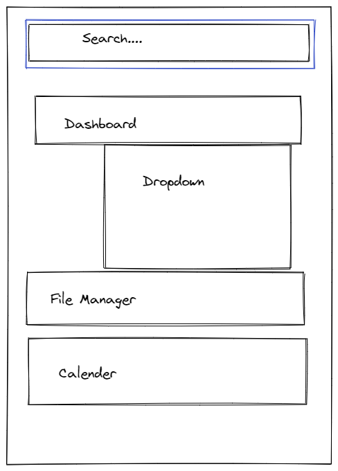 | 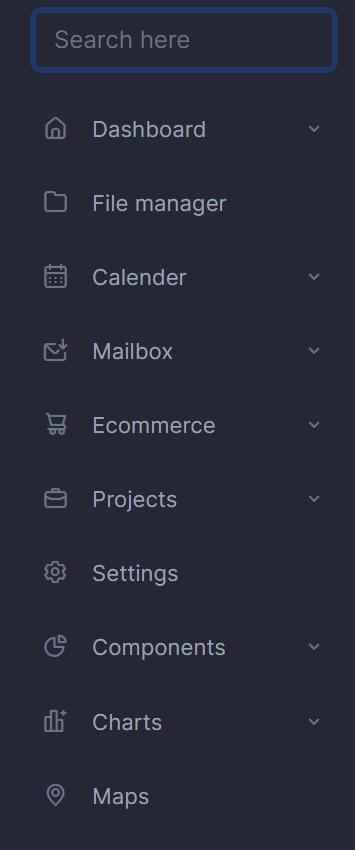 |

I didn't finish the dropdown menu part, since I was called out for PCR.

## 4/27

For 4/27, I mainly target with layouting `<div>` blocks in `HTML`, onlike other webdevs whom starts off with javascript+live server direct site featuring and instant viewing with `SCSS` serving, I personally prefer the "dumber" way in which I manage one single page with different blocks and start to write `CSS` styling based off with the current tabs, I mainly targeted with a smooth admin panel, they way for reaching this is simply set the `offset-x: 0;` in css and style the div with some `border-radius` element in order to serve a metamorphism-styled oblong shape (newly learned Geometry vocab, simply rectangles with rounded corners as the depiction in the image below). After all these tedious basic setups, all my `<div>` blocks seems perfectly oblong shaped, but I instantly realized a problem, if I just simply did,

```css
div {
  border-radius: 50px;
  ...
}
```

then `<divs>` on the entire page will be border rounded, what if I have another `<div>` wrapped inside another one? That's the really basic mistake I always make, which I usually aim at the final prodiction but not the details, the solution is just simple add a class in side the HTML file and specify the class's style in CSS, as follow,

The HTML, I defined a class called `oblong` within the `<div>` which will make the HTML file "look up" the `oblong` class in CSS and serve its style directly to the `<div>` block, pretty much like a puzzle solving game, :)

```html
<div class="oblong"></div>
```

The CSS,

```css
.oblong {
  border-radius: 50px;
  /* yea this works */
}
```

For the rest of the rest of the class I mainly optimized the smoothness on loading page.
<p align="left">
</img>
<- This is Oblong
</p>

## 4/29

For 4/29 I mainly worked on the rest of the page since I have written the default CSS style, the default version of navbar is finished as shown in the image below,

And for the rest of the class, I worked on the second quarter part of the webpage, which is the personal profile&&multifunctional sidebar.


## 5/3

After returned from the short break, I almost forgot where I left off with my webpage but I still recalled the thing I did from last week (that
s where I starts to feel nice on writing developmental journals as it helps you build your memory), during finishing up the rest of the page I accidentally clicked on "mobile view" option provided by chrome in development tools and it drived me crazy because I missed to do one important thing-responsiveness adjustment, but the code here is half way done, I didn't know how to proceed, what directly comes out of my mind is just to simply add the following line of HTML to my original code,

```html
<meta name="viewport" content="width=device-width, initial-scale=1.0">
```

This helps on setting the viewport of your page, which will give the browser instructions on how to control the page's dimensions and scaling. But I soon realized that different phones have different dimensions whereas a smaller phone might experience overflow of content out of their webpages, but phones with relatively greater dimensions will have better viewing ports hence the solution for this is to set `margin` style to either `auto` or `200px` for squeezing the page into center on mobile view, as a result, it didn't work. After a long tedious research, I finally got my solution on [@stackoverflow](https://stackoverflow.com/questions/32598727/why-does-margin-right-not-work-but-margin-left-margin-top-and-margin-bottom-do), the user asked a question simlilarly as I did then I instantly knew where the problem is.

to use the `@media-query` element for a specific block, as described below,

```css
/* Use a media query to add a breakpoint at 800px: */
@media screen and (max-width: 800px) {
  .left, .main, .right {
    width: 100%; /* The width is 100%, when the viewport is 800px or smaller */
  }
}
```
In addition to resize text and images, it is also common to use media queries in responsive web pages, With media queries you can define completely different styles for different browser sizes, then I looked up different phone's dimentsion and made a table below for easier access to development,


| Phone                   | Height | Width | Depth | Weight | Screen |
| ----------------------- | ------ | ----- | ----- | ------ | ------ |
| HTC One X+              | 134.36 | 69.90 | 8.90  | 129    | 4.7    |
| HTC One S               | 130.90 | 65.00 | 7.80  | 119    | 4.3    |
| HTC DNA                 | 141.00 | 70.50 | 9.73  | 142    | 5.0    |
| HTC Sensation 4g        | 126.10 | 65.40 | 11.30 | 148    | 4.3    |
| LG Nexus 4              | 133.90 | 68.70 | 9.10  | 139    | 4.7    |
| LG Optimus 4x HD        | 132.40 | 68.10 | 8.90  | 141    | 4.7    |
| LG Optimus G            | 131.90 | 68.90 | 8.45  | 145    | 4.7    |
| Sony Xperia T           | 129.40 | 67.30 | 9.35  | 139    | 4.55   |
| Sony Xperia SL          | 128.00 | 64.00 | 10.6  | 144    | 4.3    |
| Samsung Galaxy Note     | 147.00 | 83.00 | 9.65  | 178    | 5.3    |
| Samsung Galaxy Note II  | 151.00 | 80.50 | 9.40  | 180    | 5.5    |
| Samsung Galaxy S3       | 136.60 | 70.60 | 8.60  | 133    | 4.8    |
| Samsung Galaxy Nexus    | 135.50 | 67.94 | 8.94  | 135    | 4.65   |
| Moto Razr M             | 122.50 | 60.90 | 8.30  | 126    | 4.3    |
| Moto Razr Maxx HD       | 131.90 | 67.90 | 9.30  | 157    | 4.7    |
| Moto Razr i             | 122.50 | 60.90 | 8.30  | 127    | 4.3    |
| Moto Droid Bionic       | 127.50 | 66.90 | 10.90 | 159    | 4.3    |
| Asus Padfone 2          | 136.60 | 70.60 | 8.60  | 135    | 4.7    |
| Lumia 920(windowsphone) | 130.30 | 70.80 | 10.70 | 185    | 4.5    |
| iPhone 5 (iOS)          | 123.80 | 58.60 | 7.60  | 112    | 4.0    |
| iPhone 4S (iOS)         | 115.20 | 58.60 | 9.30  | 137    | 3.5    |

After this I started <kbd>ctrl</kbd>+<kbd>c</kbd>, <kbd>ctrl</kbd>+<kbd>v</kbd> dimension scales into CSS stylesheets for responsive adjustment.

# 5/5
The first version of my admin panel is out! :) released under domain: https://alex-admin.vercel.app/, hosted on vercel, secoundary domain provided by vercel (or I could use my own one but I didn't want to waste time on `CNAME` domain configuration). By far this webpage only provides a webfronted basic UI components+web interactions, not further backend support has been enabled, users have to manually integrade backend servers themselves, the admin panel serves the feature of, personal profile, navbar for quick access, weather reporting, newsletter recieve, real time data charts, twitter & facebook [oEmed](https://publish.twitter.com/oEmbed) for direct tweet viewing, multifunctional sidebar, file transmitting speed preview, calendar features and more... Still not completed.

List of things I didn't achieve so far,

- A little typo found by Mr. Luke, instead of May, I mistakenly type AMAY


- IOS responsiveness not fixed
- Favicon not added
- ...

## ACCESS FM
- A-Aesthetics, the product (which refer to admin panel in the following text) is a carefully designed admin panel for public usages, the color of the product mainly followed MDUI design principles published by google, the color needs to be attractive for attention spot when a user comes to visit the site, I mainly picked #1f253d as my main background color (color palette generated from coolors) and it's affiliated colors from dark to light, green, red, yellow and blue for different features, the style mainly followed my design sketches, and a little touch of design principles from google designs.
- C-Cost, this product cost absolutely **0** in any type of currency, the project itself is open source and the cost of the project to make is also zero. Figma provides a free solution for students which we can register under SLAS's email domain, also vercel is a free platform for hosting web apps, for domain, I picked vercel default witha a custom prefix `alex-admin` and the fallback domain `vercel.app` is provided by vercel platform, or I can choose my own domain to use but I didn't.
- C-Customer: The costumer of the project could be at any ages, for those people who want to use the panel as a template for backend or for people who just started learning webdev. So far I didn't recieve any likes or dislikes for my project but from my course teacher, it might be viewed more in the future, but I cannot conclude by far.
- E-Environment: The product will likely not to affect the enviroment, it is redesignable and redeployable. The project does not harm environment in any way, one affect might be increasing the burden of Vercel's server.
- S-Size: The size of my project is responsive, which means it could either fit into a computer screen or a mobile screen for viewing experiences, (mostly 1920\*1080 for web screens), since the final product is an online web application yet responsive, it does not matter how user size different devices, the site itself will readjust viewport to fit viewer's demands.
- S-Safety: This project is absolutely safe because it's open sourced and it is only a static webpage with pure HTML+CSS+JS with no external library implemented, it might hurt other users if they redesign and rewrote page for mallicious sites, but in most case scenarios, my project is safe.
- F-Function: The projects is a admin panel that mainly serves the feature of viewing data in the **painless way** in which no more complex panel structure should be found but easy block structures, this is the main idea of my design. It can be improved in a lot of ways, under my design every single block that contains a feature have a really easy code portion which users can implement new features easily.
- M-Material: The materials used in this project is HTML+CSS+JS+PSD+FIGMA, these cannot be technically called "materials" but these things are really how I built up the pronect. The product is made using Figma IDE+Adobe Photoshop&Visual studio code. The project materials could be improved by using _Vue lang_ instead of HTML because the final presentaion on web will be smoother than traditional _HTML_.

## Design Brief

I personally wanted to create this admin panel since I first started off self-learning webdev and luckily SLAS provides graphic design as a course option, which produces this opportunity for me in order to design and produce this admin panel on both UI and code side. Most of the admin panel on internet is not open sourced or you'll have to pay in order to reach their services, yet some of the open sourced projects do not have UI design that fits my demand, hence the project recieved its bith. 
